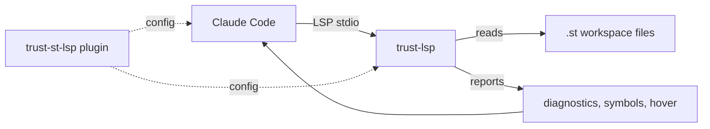

# trust-claude-plugins

[](#status)
[](https://code.claude.com/docs/en/plugins)
[](#license)

`trust-claude-plugins` brings the [truST](https://github.com/johannesPettersson80/trust-platform) IEC 61131-3 Structured Text toolchain into Claude Code.

It exposes truST's language server through Claude Code's built-in LSP plugin integration, so the agent gets the same diagnostics, navigation, hover, and call-hierarchy intelligence that VS Code does. No bridge code, no MCP wrapper — Claude Code speaks LSP, truST already speaks LSP, the plugin is just configuration.

| In One Minute | Details |
|---|---|
| Best for | Working on `.st` files in Claude Code on any host it runs on (Linux, macOS, Windows; x86_64 or arm64) and getting real ST-aware diagnostics, jump-to-def, find-references, hover, and call hierarchy from the agent |
| Not for | Editor support outside Claude Code (use the truST VS Code extension); HMI, runtime, or hardware-bus tooling (those are separate truST surfaces) |
| Current state | v0.1.0; one plugin (`trust-st-lsp`) wired to truST `v0.24.16` prebuilt binaries for Linux, macOS, and Windows |

## Contents

- [What works](#what-works)
- [Plugins](#plugins)
- [Install](#install)
- [Architecture](#architecture)
- [Status](#status)
- [Platform Compatibility](#platform-compatibility)
- [FAQ](#faq)
- [Roadmap](#roadmap)
- [License](#license)

## What works

| Capability | Surfaced in Claude Code as |
|---|---|
| Diagnostics | automatic post-edit reports; agent sees ST type errors, missing `END_FUNCTION_BLOCK`, undeclared symbols, etc. and fixes them in the same turn |
| Jump to definition | `goToDefinition` across POU files in a workspace |
| Find references | `findReferences` — every call site of an FB, function, or global |
| Hover | type info, IO declarations, attached doc comments |
| Document & workspace symbols | `documentSymbol`, `workspaceSymbol` — list and search every POU and global |
| Call hierarchy | `prepareCallHierarchy`, `incomingCalls`, `outgoingCalls` — trace the FB graph |
| Implementations | `goToImplementation` — find concrete bodies of overridden methods |

The `trust-lsp` server itself implements more (rename, code actions, semantic tokens, formatting, signature help, completions, inlay hints). Those are surfaced in the truST VS Code extension but are not currently exposed to Claude Code's agent through the LSP plugin tool.

## Plugins

| Plugin | Purpose |
|---|---|
| [`trust-st-lsp`](plugins/trust-st-lsp) | IEC 61131-3 Structured Text language server |

## Install

### 1. Download and install the `trust-lsp` binary

Pick the archive for your platform from the [truST releases page](https://github.com/johannesPettersson80/trust-platform/releases/latest):

| Platform | Archive |
|---|---|
| Linux arm64 | `trust-lsp-linux-arm64.tar.gz` |
| Linux x86_64 | `trust-lsp-linux-x64.tar.gz` |
| macOS arm64 | `trust-lsp-darwin-arm64.tar.gz` |
| macOS x86_64 | `trust-lsp-darwin-x64.tar.gz` |
| Windows x86_64 | `trust-lsp-win32-x64.zip` |

Linux / macOS one-liner (swap `linux-x64` for your target — `linux-arm64`, `darwin-x64`, or `darwin-arm64`):

```bash
mkdir -p ~/.local/bin && curl -L https://github.com/johannesPettersson80/trust-platform/releases/latest/download/trust-lsp-linux-x64.tar.gz | tar -xz -C ~/.local/bin && chmod +x ~/.local/bin/trust-lsp
```

Then confirm it's on your `PATH`:

```bash
which trust-lsp
```

If it returns nothing, add the install dir to `PATH` (`export PATH="$HOME/.local/bin:$PATH"`) or restart your shell. See [`plugins/trust-st-lsp/README.md`](plugins/trust-st-lsp/README.md) for Windows, from-source, and troubleshooting details.

### 2. Install the plugin in Claude Code

In a Claude Code session at your truST workspace:

```text
/plugin marketplace add johannesPettersson80/trust-claude-plugins
/plugin install trust-st-lsp@trust-claude-plugins
```

Open any `.st` file. Run `/plugin` → **Errors** tab — empty means the server started cleanly.

## Architecture



| Layer | Responsibility |
|---|---|
| Claude Code | hosts the agent, speaks LSP to the language server, surfaces diagnostics + navigation tools |
| `trust-st-lsp` plugin | declarative config that tells Claude Code which binary to start and which extensions to map (`.st` → `structured-text`) |
| `trust-lsp` binary | truST's language server — full IEC 61131-3 ST parser, type system, and IDE intelligence |
| `.st` workspace files | the project the agent is working on |

## Status

| Item | Current state |
|---|---|
| Plugin version | `0.1.0` |
| LSP server | `trust-lsp` from truST `v0.24.16` |
| Distribution | this marketplace + GitHub Releases on the truST repo |
| Verified surfaces | diagnostics, navigation, symbols, hover, call hierarchy |
| Pending | Anthropic official-marketplace submission |

## Platform Compatibility

`trust-lsp` ships prebuilt binaries from the truST [release page](https://github.com/johannesPettersson80/trust-platform/releases) for every platform Claude Code runs on:

| Platform | Archive |
|---|---|
| Linux x86_64 | `trust-lsp-linux-x64.tar.gz` |
| Linux arm64 | `trust-lsp-linux-arm64.tar.gz` |
| macOS x86_64 | `trust-lsp-darwin-x64.tar.gz` |
| macOS arm64 | `trust-lsp-darwin-arm64.tar.gz` |
| Windows x86_64 | `trust-lsp-win32-x64.zip` |

From source via `cargo install --path crates/trust-lsp` works on any Rust 1.95+ host.

## FAQ

**Why a plugin instead of an MCP server?**
Claude Code has a built-in LSP plugin integration. The truST language server already speaks LSP for the VS Code extension. Wrapping it in MCP would add a translation layer for no benefit — same server, two consumers, native protocol both ways.

**What does Claude Code consume from the LSP?**
Diagnostics (automatically after every edit Claude makes) and navigation/hover/symbols/call-hierarchy on demand. Other LSP features (completions, code actions, rename, semantic tokens, formatting) are implemented by `trust-lsp` but Claude Code does not currently surface them to the agent.

**Does this work without the truST VS Code extension?**
Yes. The plugin only needs the `trust-lsp` binary on `$PATH`. The VS Code extension is independent.

**Does this work on edge hardware?**
Yes — verified on a Raspberry Pi 5 (linux-arm64), the target hardware for truST runtime deployments. If the LSP is responsive on a Pi, it is responsive on a workstation.

## Roadmap

- Submit to the official Anthropic marketplace.
- Surface `signatureHelp`, `completion`, and `codeAction` to the agent once Claude Code's LSP tool expands.
- Add `trust-debug` and `trust-runtime` plugins for runtime-side workflows (live IO inspection, cycle introspection, retain inspection).

## License

Licensed under either of:

- [MIT](LICENSE-MIT)
- [Apache-2.0](LICENSE-APACHE)
